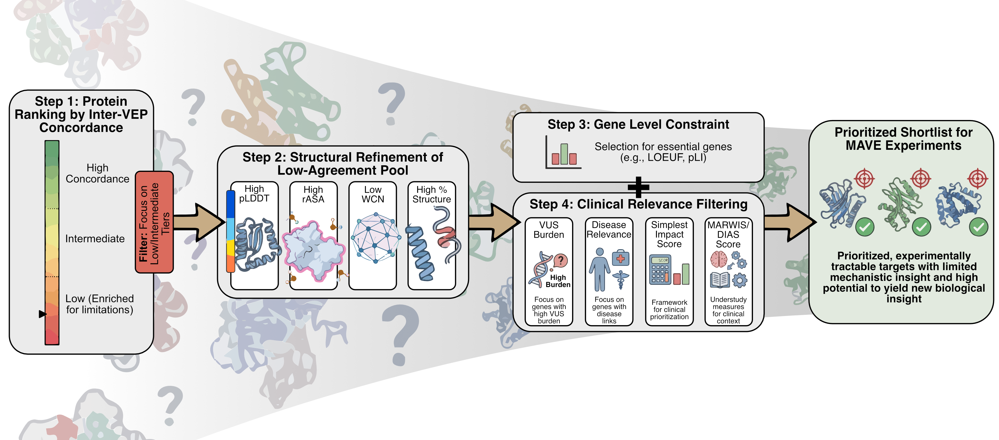

<br>

<p align="center">
  
</p>

<br>

# 🧬 _2026_jonsson_veps

This repository contains Python code and analysis scripts used to reproduce the results of the scientific paper:

**Disagreement among variant effect predictors guides experimental prioritization of target proteins**

N. F. Jonsson¹, J. A. Marsh²*, K. Lindorff-Larsen¹*

¹ Linderstrøm-Lang Centre for Protein Science, Department of Biology, University of Copenhagen, Copenhagen, Denmark  
² MRC Human Genetics Unit, Institute of Genetics and Cancer, University of Edinburgh, Edinburgh, United Kingdom  

*Corresponding authors*  

Correspondence:  
joseph.marsh@ed.ac.uk  
lindorff@bio.ku.dk  

---

## 🔍 Overview

Interpreting the functional consequences of genetic variation, particularly rare missense variants, remains a major challenge in human genetics. Computational variant effect predictors (VEPs) provide scalable predictions across the proteome, while multiplexed assays of variant effects (MAVEs) offer detailed experimental measurements but remain resource intensive.

In this work we analyse predictions from multiple VEPs across more than 13,000 human proteins and quantify the degree of agreement between predictors. We show that inter-predictor concordance varies widely across proteins and does not correlate with agreement to experimental MAVE data. These results suggest that disagreement among predictors may highlight proteins where experimental measurements will be particularly informative.

This repository contains the analysis scripts used to generate the results and figures presented in the manuscript.

---

## 💾 Data

Due to their size, the datasets used in this study are hosted externally on ERDA.

The ERDA archive contains the processed datasets used in the analysis as well as intermediate files required to reproduce the figures presented in the manuscript.

(ERDA link to be added)

---

## 📜 License

The source code in this repository is licensed under the permissive MIT License.

---

## 🐞 Bugs

For any bugs please report the issue on the project GitHub page or contact one of the authors listed in the manuscript.

---

## 📄 Citing this work

If you use this code or data please cite:

Jonsson, N. F., Marsh, J. A., & Lindorff-Larsen, K.  
*Disagreement among variant effect predictors guides experimental prioritization of target proteins.*

(preprint / journal reference to be added)

```
@ARTICLE{Jonsson2026,
  title  = "Disagreement among variant effect predictors guides experimental prioritization of target proteins",
  author = "Jonsson, Nicolas F. and Marsh, Joseph A. and Lindorff-Larsen, Kresten",
  year   = "2026"
}
```
